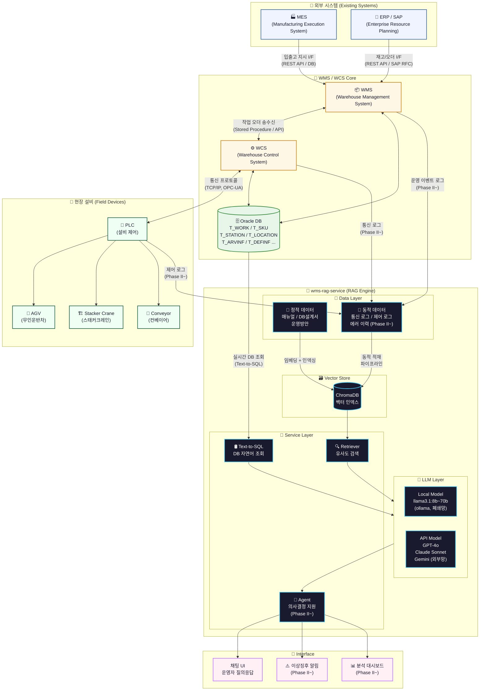

# 🏭 wms-rag-service
> **RAG Service Engine for WMS/WCS Framework**  
> 자동화 창고 시스템(WMS/WCS) 운영 지원을 위한 LLM 기반 RAG 서비스 엔진


---

## 📌 Overview

현장 운영자와 개발자를 위한 **도메인 특화 AI 질의응답 + 의사결정 지원 시스템**입니다.  
WMS/WCS 매뉴얼, DB 설계서, 운영 로그 등을 RAG 데이터로 활용하여  
자연어 기반의 창고 운영 지원 및 이상징후 감지를 목표로 합니다.
## 🏗️ System Architecture



---

## 📡 API / Interface 연결 포인트 요약

| 구간 | 연결 방식 | 방향 | Phase |
|------|-----------|------|-------|
| MES → WMS | REST API / DB I/F (Stored Procedure) | 단방향 | 기존 |
| ERP/SAP → WMS | REST API / SAP RFC | 단방향 | 기존 |
| WMS ↔ WCS | Stored Procedure / Internal API | 양방향 | 기존 |
| WCS ↔ PLC/AGV | TCP/IP, OPC-UA 통신 프로토콜 | 양방향 | 기존 |
| Oracle DB → RAG | Text-to-SQL (직접 쿼리) | 단방향 | Phase I~ |
| WCS 통신 로그 → RAG | 로그 파이프라인 → ChromaDB | 단방향 | Phase II~ |
| PLC 제어 로그 → RAG | 로그 파이프라인 → ChromaDB | 단방향 | Phase II~ |
| RAG → 운영자 UI | 채팅 / 알림 / 대시보드 | 단방향 | Phase 0~ |

---

## 🗺️ Roadmap

```
Phase 0 ──────── Phase I ──────── Phase II ──────── Phase III
  ✅ 완료           🚧 진행중          📋 TBD              🔭 장기목표
기본 QA           QA + DB 조회     복합분석 + 의사결정    자동화 + 지능화
```

---

### ✅ Phase 0 · 기본 QA
> **정적 RAG 데이터 기반 도메인 질의응답**

- 매뉴얼, DB 설계서 등 정적 문서 기반 RAG 구성
- OracleDB 연동 (Text-to-SQL 품질 개선 필요)

**활용 예시**
```
Q. 긴급 출고 방법은?
Q. 모니터링 화면에서 확인할 수 있는 RTV 정보는?
Q. 스태커크레인 수동 조작 절차는?
```

**지원 모델**
| 구분 | 모델 | 비고 |
|------|------|------|
| Local | `llama3.2:3b` ~ `llama3.2:8b` (ollama) | CPU only 가능 |
| API | `groq` / `gemini` API key | 무료, 토큰 제한 있음 |

---

### 🚧 Phase I · QA + DB 조회 *(단기 데모)*
> **정적 RAG + 실시간 DB 조회 기반 질의응답**

- 설계서, 운영방안, 매뉴얼 + DB 실시간 조회 결합
- Text-to-SQL 품질 향상 목표

**활용 예시**
```
Q. 현재 재고 팔레트 종류는?
Q. 이 창고는 몇 Row-Bay-Level로 구성되었어?
Q. 02.26일자 출고 공팔레트 현황 요약해줘.
```

**지원 모델**
| 구분 | 모델 | 비고 |
|------|------|------|
| Local | `llama3.1:8b` ~ `llama3.3:70b` | 폐쇄망 OK, GPU 필요 |
| API | `GPT-4o`, `Claude Sonnet`, `Claude Haiku` | 폐쇄망 불가, 토큰 비용 발생 |

**권장 GPU** : RTX 3090 ~ 4090

---

### 📋 Phase II · 복합분석 + 의사결정 *(TBD)*
> **동적 로그 적재 + 이상징후 감지 + 운영 최적화 지원**

- 통신/제어 로그 → ChromaDB 동적 적재 파이프라인 구성
- 실시간 이상징후 감지 및 운영 의사결정 지원

**활용 예시**
```
Q. 이상 징후(에러)가 빈번하거나 최근 사용량이 많은 스태커 호기는?
Q. 존별 처리량 불균형이 있나?
Q. 최근 1주일간 AGV 경로 에러 패턴 분석해줘.
```

**아키텍처**
```
통신/제어 로그
      │
      ▼
 파이프라인 (전처리 + 청킹)
      │
      ▼
 ChromaDB (동적 벡터 적재)
      │
      ▼
 LLM + RAG → 이상징후 감지 / 의사결정 지원
```

---

### 🔭 Phase III · 자동화 + 지능화 *(장기 목표)*
> **WCS 개입 최소화 + 물류 흐름 자율 최적화 + 예지정비**

- 출고 우선순위 자동 조정 제안
- 설비 예측 유지보수 (Predictive Maintenance)
- 물류 흐름 최적화 자율 제안 및 적용

**활용 예시**
```
Q. 출고 우선순위 자동 조정 제안해줘.
→ 현재 재고 상태, 출고 오더, 설비 상태를 종합 분석 후 최적 순서 제안
```

**목표 모델**
| 구분 | 스펙 | 비고 |
|------|------|------|
| 모델 | Fine-tuned 70B+ | WCS 도메인 특화 튜닝 |
| GPU | A10G / RTX 5090 | ~~A100~~ ~~온프레미스 GPU 서버~~ |

---

## 🛠️ Tech Stack

```
LLM          ollama / groq / gemini / GPT-4o / Claude
Vector DB    ChromaDB
DB           Oracle DB
Framework    (작성 예정)
```

---

## 📁 Project Structure

```
wms-rag-service/
├── data/
│   ├── static/          # 매뉴얼, 설계서 등 정적 RAG 데이터
│   └── logs/            # 통신/제어 로그 (Phase II~)
├── pipeline/            # 로그 전처리 및 ChromaDB 적재
├── rag/                 # RAG 검색 및 LLM 연동
├── api/                 # 서비스 API
└── README.md
```

---

## 📄 License

MIT
